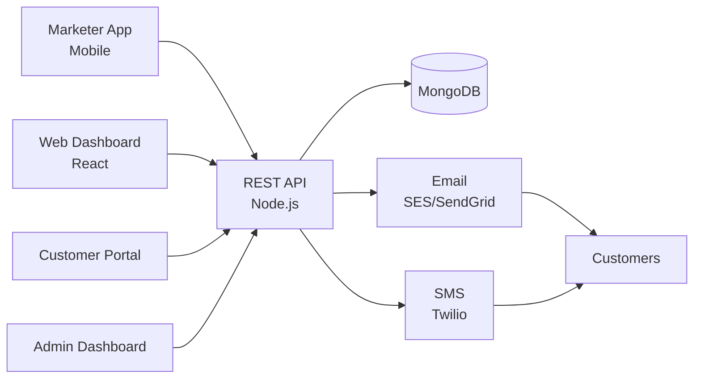

# Activecampaign Clone — White-Label Marketing Automation & CRM Platform by Miracuves

**MXChimp** is a production-ready, white-label Activecampaign clone: a complete marketing-automation & CRM platform with campaigns, automation, and admin console — delivered with **100% source code ownership** in **6 working days**.

> 📧 **See it running before you talk to anyone.** Live marketer console, customer portal, and admin dashboard — demo credentials are printed on the [solution page](https://miracuves.com/activecampaign-clone#demo). No sales call required.

---

## 🚀 Live Demos

| Environment | URL | What you can test |
|---|---|---|
| 📱 Marketer App | [mas.mimeld.com](https://mas.mimeld.com) | Send campaigns, automation, push, reports |
| 🌐 Web Dashboard | [mxchimp.mimeld.com](https://mxchimp.mimeld.com) | Full marketing automation in browser |
| 👤 Customer Portal | [Solution page → Demo](https://miracuves.com/activecampaign-clone#demo) | Subscriptions, preferences, history |
| 🛠️ Admin Dashboard | [Solution page → Demo](https://miracuves.com/activecampaign-clone#demo) | Users, plans, billing, deliverability |

Demo credentials for all environments: **[miracuves.com/activecampaign-clone → Demo section](https://miracuves.com/activecampaign-clone/#demo)**

---

## ✨ What Makes This Activecampaign Clone Different

Most email-marketing scripts stop at "send a campaign." This platform ships with the features that actually run a marketing-automation *business*:

- **Visual Automation Builder** — drag-drop automation flows with triggers, conditions, delays, and multi-channel actions — what Mailchimp and HubSpot use
- **High-Deliverability Infra** — dedicated IP warmup, DKIM/SPF/DMARC, and bounce/spam monitoring — inbox placement is product
- **Multi-Channel Campaigns** — email, SMS, push, webhooks, in-app — all under one campaign and one analytics — ActiveCampaign's moat
- **AI Send-Time Optimisation** — predicts each recipient's best open window — open rates jump 15-25% automatically
- **White-Label + Reseller** — agencies can rebrand the entire app, resell seats, and run their own pricing — Mailchimp's largest channel

## 📦 Core Features

**Marketer:** email & SMS campaigns · automation builder · segmentation · A/B testing · landing pages · analytics · multi-channel inbox

**Customer:** subscriptions · preferences · email center · opt-out · 1-click unsubscribe · subscriber portal

**Admin:** user management · billing · deliverability reports · compliance (GDPR/CAN-SPAM) · analytics

## 🏗️ Architecture

**Stack:** React web · Node.js or Laravel backend · MongoDB · SES/SendGrid/SparkPost for delivery · Redis for queue · Stripe, regional gateways

## 📋 What’s Included

- ✅ Full source code — backend, web, mobile apps, panels (no encryption, no license locks)
- ✅ Deployment to your servers & app store submission assistance
- ✅ Your branding — white-label rename, logo, colors, domain
- ✅ 60 days post-launch support + 12 months of free updates
- ✅ Documentation & handover

**Pricing:** from **$2,499**, transparent on the [solution page](https://miracuves.com/activecampaign-clone/#pricing) — no "contact us for quote" games.

## 🆚 Why Not Build From Scratch?

Custom marketing-automation platforms run $80k–$400k and 6–12 months. A proven white-label base gets you to market in 6 working days for a fraction of that, with your budget preserved for deliverability infra and integrations.

## 📚 Resources

- 📖 [Activecampaign Clone — Full Solution Page](https://miracuves.com/activecampaign-clone) (features, pricing, demos, FAQ)
- 💰 [How Much Does a Marketing Automation App Cost in 2026?](https://miracuves.com/activecampaign-clone#pricing) pricing breakdown & what's included
- 📝 [Best Activecampaign Clone Script in 2026](https://miracuves.com/activecampaign-clone/blog/) features, pricing & launch guide
- 🧠 [Deliverability Is the Moat — How to Get to the Inbox](https://miracuves.com/activecampaign-clone/blog/) DKIM/SPF/DMARC, IP warmup
- ✅ [Miracuves Facts & Claims Ledger](https://miracuves.com/activecampaign-clone/facts/) every claim we make, verified

## 🏢 About Miracuves

[Miracuves Solutions](https://miracuves.com) builds white-label clone apps and custom software from Mumbai, India — 90+ ready-made solutions, live demos for every product, transparent pricing, and delivery in 6 working days. Operating since 2010.

**Talk to us:** [WhatsApp](https://wa.me/919830009649) · [Schedule a consultation](https://miracuves.com/schedule-consultation/) · [miracuves.com](https://miracuves.com)

---

### ⚠️ Note on This Repository

This repository is a product overview. The full source code is delivered to clients on purchase — see [what’s included](https://miracuves.com/activecampaign-clone/#included). For a hands-on evaluation, use the live demos above; credentials are public on the solution page.

*Keywords: activecampaign clone, activecampaign clone script, marketing automation, email marketing, CRM, white label Mailchimp, automation builder, Flutter CRM, Node.js CRM*

---

<!--
══════════════════════════════════════════════════
TEMPLATE VARIABLE KEY — auto-generated from Netflix-Clone pattern
══════════════════════════════════════════════════
{APP_NAME}        Activecampaign Clone
{MX_NAME}         MXChimp
{CATEGORY}        Marketing Automation & CRM Platform
{DEMO_WEB}        mxchimp.mimeld.com
{PRICE}           $2,499
{SLUG}            activecampaign-clone
{SOLUTION_URL}    https://miracuves.com/activecampaign-clone/
{VERTICAL}        saas_crm

See /tmp/verticals/saas_crm.txt for the vertical config used to generate this README.
══════════════════════════════════════════════════
-->